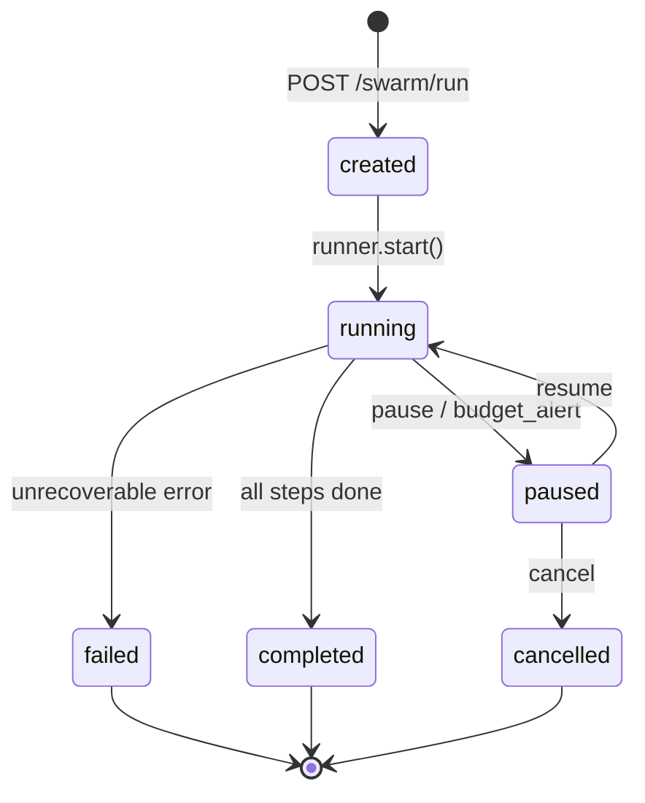
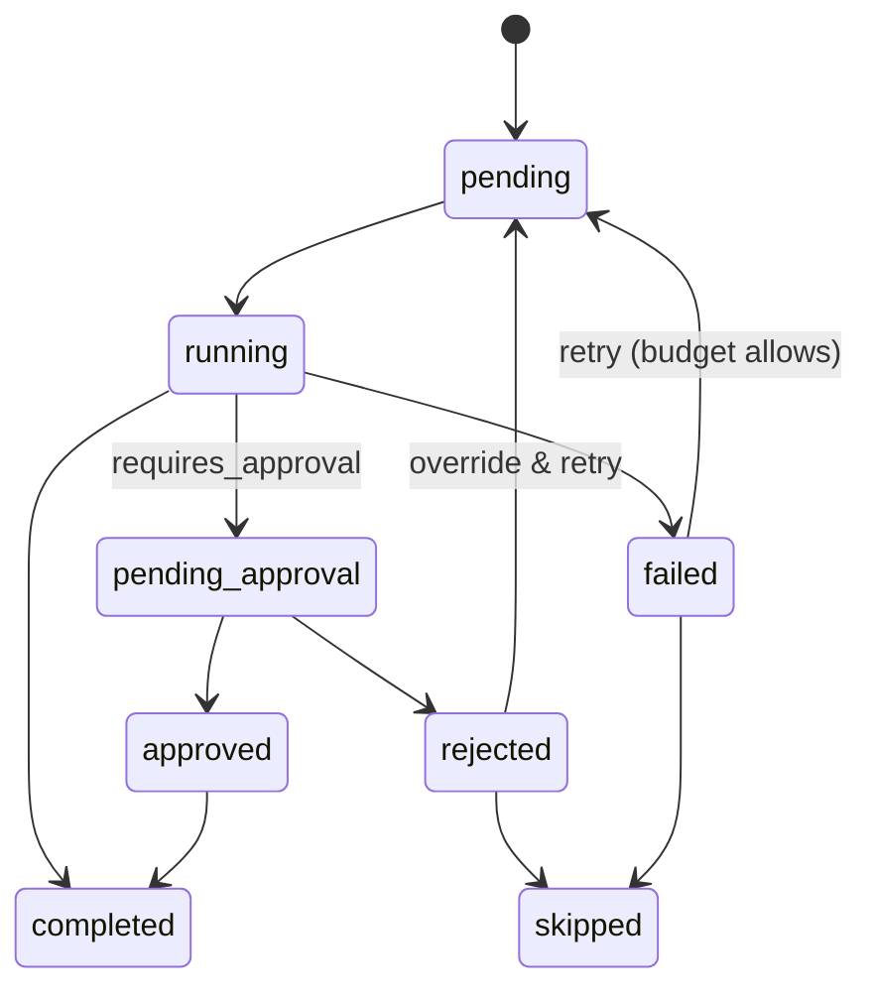
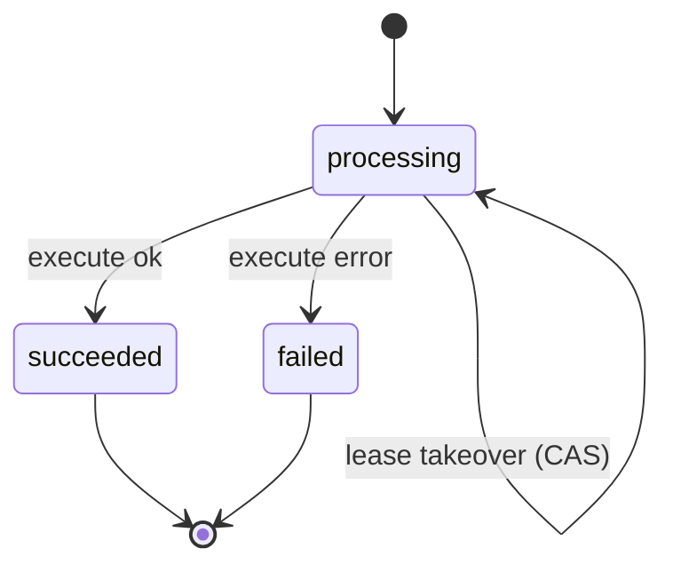
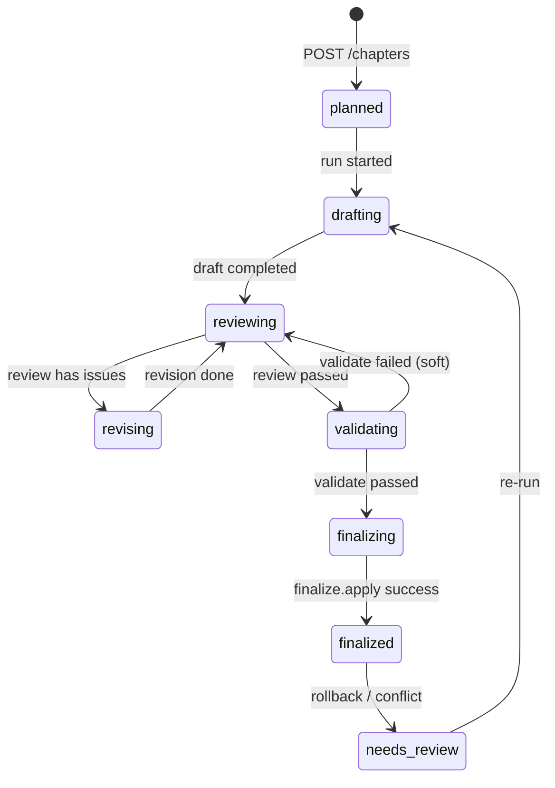
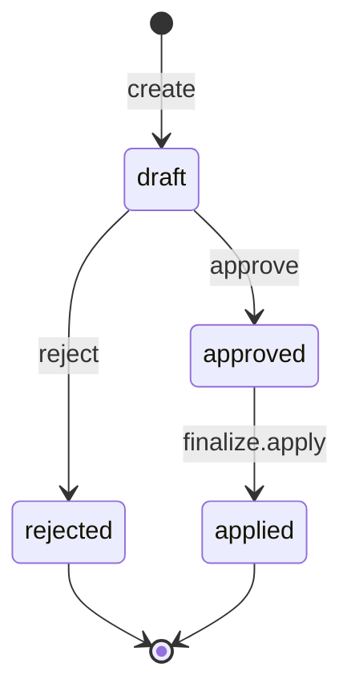

# 状态机定义（Runner + Idempotency）

## Run States

合法转移（摘要）：
- created→running
- running→paused|completed|failed
- paused→running|cancelled

## Step States

## Idempotency States（v1.4 租约）

规则：
- 同 key 同 hash：succeeded 重放返回；processing 202；lease 过期可接管
- 同 key 异 hash：409（E101_IDEMPOTENCY_CONFLICT）

## Chapter States

合法转移（摘要）：
- planned→drafting
- drafting→reviewing
- reviewing→revising|validating
- revising→reviewing
- validating→finalizing|reviewing
- finalizing→finalized
- finalized→needs_review（仅回滚/冲突时）
- needs_review→drafting

## Draft/Proposal States

